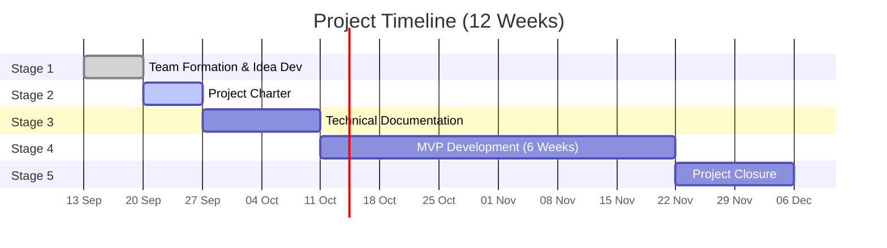

# Portfolio Project - Project Charter Development (Stage 2)
 
## Introduction
 
Stage 2 is about turning an idea into a structured plan before any code is written. In this stage we produce a **Project Charter**: a short, formal document that defines why the project exists, what it will and will not deliver, who is involved, what could go wrong, and how the work will be organized over time.
 
The value of this stage is that it forces clarity early. It gives every team member and stakeholder the same understanding of the project's purpose, scope, and priorities, and it becomes the reference point we return to whenever a decision, a trade-off, or a change request comes up during development. It also trains us in the basics of project management: formalizing information, setting measurable objectives, and identifying risks and roles before they become problems.
 
This charter applies that process to our project: a **centralized IoT operations tracking platform for contracting and field service companies**.
 
## Table of Contents
- [0. Define Project Objectives](#0-define-project-objectives)
- [1. Identify Stakeholders and Team Roles](#1-identify-stakeholders-and-team-roles)
- [2. Define Scope](#2-define-scope)
- [3. Identify Risks](#3-identify-risks)
- [4. Develop a High-Level Plan](#4-develop-a-high-level-plan)
- [5. Authors](#5-authors)
---
 
## 0. Define Project Objectives
 
 
Field operations companies in Saudi Arabia run distributed workforces: contractors with crews across several project sites, facility management companies servicing multiple client locations and security firms covering dispersed posts. These operations are still coordinated through paper attendance sheets, gate check-ins, phone calls, and WhatsApp. Almost nothing that happens on site is captured in a usable form, so decisions about staffing, task distribution, and cost are based on estimates rather than data.
 
The gap widens as a company grows. A company running a single site can manage on paper. A company running three or four concurrent sites cannot answer basic operational questions: how many hours went into Project A versus Project B, which crew was where last Tuesday, what was actually completed on each site yesterday, or whether a site was staffed as promised to the client. Labour is the largest variable cost in field work, and when labour hours are allocated by estimate, the real cost and progress of each project remain unknown.
 
Our platform is an operations tracking system. It works by tracking workers and recording their assigned tasks and location, producing a structured, automatic record of each working day. Managers oversee this through a centralized dashboard and export the records as organized reports, a documented data of their own operations that did not exist before.
 
That record produces two further benefits. First, managers gain a factual basis for staffing, scheduling, and cost allocation across concurrent projects, replacing estimates with evidence. Second, it provides documented proof of compliance with regulations, including statutory working-hour limits and the midday outdoor work ban, which organizations currently evidence with paper sheets that carry little weight during an inspection or a client audit.
 
We are not a surveillance or enforcement tool. Tracking is active during working hours only, within defined work zones, and with worker consent. The purpose is to help organizations understand and improve their own operations, enhances managerial decision-making and drastically reduces wasted operational costs, time, and effort.
 
> **Note:** For further information about the market gap, pain points, competitors, and market research, see the [Business Study](./business%20study.md).
 

### Project Purpose
 
To equip organizations with a centralized operations tracking platform that integrates wearable IoT data with a live administrative dashboard, records workforce activities to optimiz operational efficiency and reducing wasted resources.
 
### SMART Objectives
 
 1. **Improve management decisions:** Provide a pilot client with weekly operational insight reports "attendance, hours per zone, idle time, alerts" within the first month of usage.

2. **Save effort:** Reduce the time supervisors spend on manual attendance and daily reporting by 50% within 4 months of the initial deployment.

3. **Reduce wasted cost:** Identify and reduce non-productive paid hours by at least 10% for a pilot client within the first 3 months of usage.

 
---
 
## 1. Identify Stakeholders and Team Roles
 
### Project Stakeholders
 
Stakeholders represent all individuals or groups who have an interest in the project, whether they are directly involved in building it or will be affected by its deployment.
 
| Stakeholder | Category | Role / Interest in the Project | Influence |
|---|---|---|---|
| **Development Team** | Internal | Business developers and engineers building the MVP | High |
| **Holberton / Tuwaiq Mentors** | Internal | Guide the project, review deliverables, and evaluate the final outcome | High |
| **Management / Decision Makers** | External "Clients" | Operations directors or owners who decide to adopt the platform based on operational visibility, cost allocation, and compliance records | High |
| **Site Managers & Supervisors** | External "Primary Users" | Use the dashboard to assign tasks, review the daily record, and make operational decisions | High |
| **Frontline Workforce** | External "End Users" | Carry the tracking devices; their working hours and assigned tasks form the operational record | Medium |
| **Partner Organizations** "Potential" | External | Contractors, facility management firms, and security companies seeking to adopt the MVP | Medium |
| **Technology Partners** | External | Device suppliers, telecom operators, and map/cloud service providers | Medium |
| **Regulatory Bodies** | External | SDAIA "personal data protection", CST (IoT devices and SIMs), and MHRSD "labor regulations and working-hour limits" | Medium |
| **Potential Investors** | External | Evaluate the MVP as a business opportunity | Medium |
 
### Team Roles and Responsibilities
 
To ensure accountability and smooth execution during the 6-week MVP timeline, technical and administrative responsibilities have been clearly assigned.
 
| Team Member | Project Role | Core Responsibilities |
| :--- | :--- | :--- |
| **Laila** | Business, Frontend Lead & Full-Stack Developer | Oversees the project timeline and documentation. Designs the UI/UX, develops the interactive administrative dashboard, integrates the live map, and implements the reporting views, while also providing technical support across software engineering tasks. |
| **Saad** | Backend Lead & Full-Stack Developer | Builds the RESTful API, develops the backend logic engine to process incoming IoT/simulated data, and implements the working-hours and geofence rule engine, while also providing technical support across software engineering tasks. |
| **Faisal** | Database Administrator & Full-Stack Developer | Designs the database schema, manages data logging for employee profiles and daily records, coordinates historical data storage, and ensures efficient querying, while also providing technical support across software engineering tasks. |
| **Abdullah** | System Architect, DevOps & Full-Stack Developer | Maps the overall system architecture, manages cloud deployment, builds the data simulation scripts and hardware integration, and handles network routing, while also providing technical support across software engineering tasks. |
 
---
 
## 2. Define Scope
 
**Scope Statement:**
The scope of this 6-week MVP is focused on proving the core concept: a centralized platform that integrates with IoT wearable devices, receives and logs site workers' location and working hours, links them to assigned tasks and project sites, and turns the result into a structured daily record with alerts and exportable reports. The MVP establishes the foundational structure "company accounts, project sites, employee profiles, and a scalable database" that future features will be built on.
 
**In-Scope:**
*   **IoT Device Integration:** Connecting at least one GPS wearable device to the system, supported by a device simulator for development and testing.
*   **Backend & API:** A RESTful API that receives, validates, processes, and stores incoming telemetry data.
*   **Database Structure:** A centralized database designed to store companies, project sites, employee profiles, devices, tasks, movement logs, and alert records.
*   **Multiple Project Sites per Company:** Companies can define more than one concurrent project site, assign workers and zones to each, and view hours and activity per site.
*   **Task & Workload Assignment:** Managers can create tasks, assign them to employees or crews, and track their status from the dashboard.
*   **Company Registration & Authentication:** Organizations can register an account, log in securely, and access only their own data.
*   **Employee Profiles & Records:** Creating and managing employee profiles, assigning devices, capturing worker consent, and keeping a daily record of each employee's activity.
*   **Live Map:** Real-time plotting of site workers on a site-specific interactive map.
*   **Geofencing:** Defining work zones on the map and detecting when a worker enters or leaves a designated zone.
*   **Automated Alerts:** A rule-based engine that triggers dashboard notifications for geofence breaches, working-hour limits, and presence in outdoor zones during the midday ban period.
*   **Movement Logs & History:** Storing timestamped location history in a tamper-evident form, and allowing managers to review past activity for any employee.
*   **Reports & Exports:** Generating daily, weekly, and monthly PDF reports covering attendance, hours per project and zone, task completion, and recorded events, with a verifiable reference number.
*   **Landing Page:** A simple public page introducing the platform and directing organizations to register.

**Out-of-Scope:**
*   **Health & Vital-Sign Monitoring:** Heart rate, body temperature, heat-stress detection, and any other biometric sensing. The platform records location, working hours, and tasks only.
*   **Advanced Analytics & Dashboards:** Charts, trend analysis, and predictive insights. Operational output in the MVP is delivered as structured PDF reports.
*   **Map Search:** Searching for specific workers directly on the map.
*   **Mobile Version & Native Applications:** Standalone iOS/Android apps for managers or workers.
*   **SOS & Distress Signals:** Allowing workers to send emergency distress signals from their devices.
*   **Automatic Emergency Dispatch:** Automatically alerting the nearest ambulance or emergency services during critical incidents.
*   **Enterprise System Integrations:** Integration with external third-party software such as HR, payroll, or ERP systems.
*   **Advanced AI Analytics:** Implementing machine learning or complex predictive AI models for worker behavior.
*   **Indoor Tracking:** Positioning inside buildings using BLE, UWB, or on-site gateways.
*   **Offline Mesh Networking:** Building complex local networks for areas with zero internet coverage; the MVP assumes data reaches the server via standard internet protocols.
*   **Billing & Subscriptions:** Payment processing and subscription plan management.
---
 
## 3. Identify Risks
 
Anticipating potential challenges is critical for maintaining the 6-week MVP timeline. The following table identifies high-priority risks across technology, hardware, timelines, scope, and team dynamics during the development period, along with proactive mitigation plans.
 
> **Note:** For business and technical risks expected within 6 months after the MVP, see the [Business Study](./business%20study.md).
 
### Development Risks "6-Week MVP"
 
| Risk Category | Potential Risk | Mitigation Strategy |
|---|---|---|
| **Integration** | **Frontend-Backend Bottleneck:** Frontend development stalls while waiting for the Backend API to be fully functional. | **Mitigation:** Define a strict API contract in Week 1. Use mock APIs so the Frontend can be built and tested independently of the Backend progress. |
| **Hardware Procurement** | **Device Delays:** The IoT wearables arrive late, get held at customs, or do not support the expected communication protocol. | **Mitigation:** Order 2–3 device models early from different suppliers, and start development using the device simulator. |
| **IoT Compatibility** | **System-Device Mismatch:** The system is built around assumed data formats, but the real IoT device sends data in a different protocol or structure, which breaks the integration. | **Mitigation:** Test a real device's raw data output before finalizing the database and API design. Use a middleware layer (e.g., Traccar) to normalize incoming data, so the system does not depend on a single device format. |
| **Hardware** | **Hardware/Network Failure:** The physical IoT device fails to connect or the internet drops during the final live presentation. | **Mitigation:** Develop a fully tested Python simulation script as a permanent backup. If hardware fails, the script will instantly inject simulated data into the API to keep the demo running seamlessly. |
| **Performance** | **Live Map Overload:** Continuous real-time data streaming causes the web dashboard or map to freeze or crash during the demo. | **Mitigation:** Implement data throttling and optimize UI re-rendering logic. |
| **Technical Skills** | **Learning Curve:** The team has limited prior experience with IoT protocols, real-time data, and map APIs, which slows development. | **Mitigation:** Allocate time in Week 1 for research and small proof-of-concept tests, and rely on well-documented tools. |
| **Data Protection** | **Personal Data Exposure:** Worker location and working-hour data is personal data under the PDPL; storing or sharing it without protection or consent creates legal and ethical exposure. | **Mitigation:** Capture worker consent during enrolment, limit tracking to working hours and defined zones, use authentication and HTTPS from the start, restrict database access, and use simulated data in shared demos. |
| **Record Integrity** | **Untrusted Records:** If logs can be edited after the fact, the exported reports lose their value as evidence for clients or inspectors. | **Mitigation:** Store activity logs in a tamper-evident form. Corrections are appended as new entries showing who changed what and when, never by overwriting the original record. |
| **Adoption** | **Supervisor Drop-off:** Supervisors stop using the dashboard because task updates feel like extra daily paperwork, which breaks the data record. | **Mitigation:** Keep task interaction to a single action (assign, mark complete). No mandatory free-text entry, percentages, or multi-step forms in the MVP. |
| **Timeline** | **Missed Deadlines:** Tasks take longer than estimated, or team members have competing program deadlines, delaying delivery. | **Mitigation:** Break work into weekly sprints with clear deliverables, track progress on a shared task board, and prioritize core features first. |
| **Scope** | **Scope Creep:** The team attempts to add unplanned features, jeopardizing the 6-week MVP deadline. | **Mitigation:** Strictly adhere to the "In-Scope" items defined in this charter. Any new feature requests must be documented in a backlog for post-MVP phases. |
| **Team Dynamics** | **Knowledge Silos:** Only one person understands a critical component. | **Mitigation:** Conduct weekly sync meetings and daily stand-ups to maintain a clear, shared understanding of all system architectures and API endpoints. |
 
---
 
## 4. Develop a High-Level Plan
 
The high-level plan outlines the major stages and milestones of the project over 12 weeks. It gives the team a shared view of what needs to be delivered and when, helps us track progress against deadlines, and makes it easy to spot delays early. **The plan is presented at two levels:** an overview of the five project stages, followed by a detailed week-by-week breakdown of the MVP development stage showing how the in-scope features are distributed across the team.
 
### Timeline Overview
 

 
| Stage | Timeline | Key Milestone / Deliverable |
|---|---|---|
| **Stage 1: Team Formation & Idea Development** "Completed" | W1: 13 Sep - 19 Sep | Team formed and the project concept selected |
| **Stage 2: Project Charter Development** | W2: 20 Sep - 26 Sep | Completed and approved Project Charter |
| **Stage 3: Technical Documentation** | W3 - W4: 27 Sep - 10 Oct | User stories, system architecture, database schema, API routes, and UI wireframes |
| **Stage 4: MVP Development** | W5 - W10: 11 Oct - 21 Nov | Functional dashboard with live map, geofencing, task assignment, alerts, and exportable reports, integrated with real and simulated IoT data |
| **Stage 5: Project Closure** | W11 - W12: 22 Nov - 5 Dec | Final testing, presentation, and project documentation |
 
### MVP Development Breakdown
 
The following breakdown is a **preliminary plan** that distributes the MVP scope across 6 weekly sprints. It will be reviewed and finalized after completing the user stories and technical requirements in Stage 3, and then refined through sprint planning at the start of each sprint during development.
 
| Week | Dates | Backend & Database | Frontend & Dashboard | IoT & Integration | Milestone |
|---|---|---|---|---|---|
| **W5** | 11 Oct - 17 Oct | Project setup, database implementation (companies, sites, employees, devices, logs, tasks, alerts) | Project setup, dashboard layout, and UI components based on wireframes | Configure Traccar server, build the device simulator, test real device connection | Development environment ready; first data received from device/simulator |
| **W6** | 18 Oct - 24 Oct | Company registration & authentication API, project sites and employee profiles CRUD, consent capture | Registration & login pages, site management and employee profiles pages (using mock APIs) | Data ingestion pipeline: receive, validate, and store telemetry data | Users can register, log in, define sites, and manage employee profiles |
| **W7** | 25 Oct - 31 Oct | Device assignment, telemetry & movement logs endpoints, tamper-evident log storage | Live map integration (Google Maps) showing workers in real time per site | Connect ingestion pipeline to the live map data flow | Workers appear live on the map, logs stored reliably |
| **W8** | 1 Nov - 7 Nov | Geofence storage & breach detection, rule engine for working-hour limits and midday-ban window | Geofence drawing on the map, alerts notification panel | Test alerts with simulated scenarios (zone exit, hour limit, midday presence) | Geofencing and automated alerts working end-to-end |
| **W9** | 8 Nov - 14 Nov | Task assignment endpoints, daily records, hours-per-site aggregation, PDF report generation | Task assignment view, daily record view, reports page with date-range export | Field test with real device(s), fix data issues | Tasks, daily records, and PDF reports available |
| **W10** | 15 Nov - 21 Nov | Bug fixes, security checks, performance optimization | Landing page, UI polish, bug fixes | Full end-to-end testing, demo backup with simulator | MVP complete and demo-ready |
 
---
 
## 5. Authors
 
* **Laila Alghamdi** |
[GitHub](https://github.com/laila-khalid)
* **Abdullah Alzara** |
 [GitHub](https://github.com/JSAbdullaH)
* **Faisal Alshahrani** |
 [GitHub](https://github.com/call-me-prof)
* **Saad Alatar** |
[GitHub](https://github.com/SaadTAr)
 