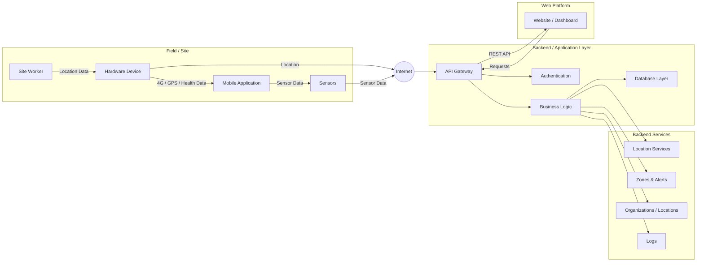

# Portfolio Project - Technical Documentation (Stage 3)

## Introduction

Stage 3 of the Portfolio Project is about turning the project's objectives and requirements into a detailed technical plan before development begins. In this stage we produce the **Technical Documentation**: the blueprint that defines what the system will do from the user's perspective, how it will be built, how its components will interact, and how we will manage and test our code.

The value of this stage is that it removes guesswork from development. It gives every team member a clear understanding of the system's architecture, data structures, and interfaces, so that frontend, backend, and IoT work can progress in parallel without conflicts. It also ensures that every technical decision is justified by our functional and non-functional requirements, reducing the risk of rework during the 6-week MVP.

This document builds on the scope defined in our [Project Charter](./Stage%202.md).

## Table of Contents
- [0. Define User Stories and Mockups](#0-define-user-stories-and-mockups)
- [1. Design System Architecture](#1-design-system-architecture)
- [2. Define Components, Classes, and Database Design](#2-define-components-classes-and-database-design)
- [3. Create High-Level Sequence Diagrams](#3-create-high-level-sequence-diagrams)
- [4. Document External and Internal APIs](#4-document-external-and-internal-apis)
- [5. Plan SCM and QA Strategies](#5-plan-scm-and-qa-strategies)
- [6. Technical Justifications](#6-technical-justifications)
- [7. Authors](#7-authors)

---

## 0. Define User Stories and Mockups

The purpose of this task is to identify and prioritize the MVP's functionalities from the user's perspective and visualize its main interface.

Our team follows the Scrum methodology to manage development. Before writing user stories, we first establish a baseline of business and technical requirements. This ensures that every user story is traceable to a clear business need and a defined technical capability, and prevents the backlog from filling with features that fall outside our scope.

Our process is as follows:

1. **Business Requirements:** Define what the organization needs from the platform, based on the objectives in our Project Charter.
2. **Technical Requirements:** Translate those needs into functional and non-functional requirements the system must meet.
3. **User Types:** Identify who interacts with the system and in what role.
4. **User Stories:** Break the requirements into user stories grouped by epic, written in the format
 "As a [user type], I want to [perform an action], so that [achieve a goal]."
5. **Prioritization:** Prioritize each story using the **MoSCoW** method: Must Have, Should Have, Could Have, and Won't Have.
6. **Mockups:** Design the main screens of the dashboard based on the prioritized stories.

The resulting user stories form our Product Backlog, which is managed in Jira. During each sprint planning session, the team selects stories from the backlog, starting with the Must Have items, and breaks them into development tasks. The requirements serve as a stable baseline for the MVP, while the backlog may be refined sprint by sprint as we learn more during development.

### 0.1 Business Requirements

| ID | Business Requirement |
|---|---|
| BR-01 | Organizations must have a complete, automatic record of field operations: attendance, movements, and alerts. |
| BR-02 | Managers must be able to see where their workers are in real time on a site map. |
| BR-03 | The system must alert managers early when a worker leaves a designated zone or shows critical vital signs. |
| BR-04 | Managers must be able to assign tasks to employees and follow their status. |
| BR-05 | Organizations must be able to review historical data to support compliance and record keeping. |
| BR-06 | Managers must receive simple operational insights to support better decisions. |
| BR-07 | Each organization's data must remain private and accessible only to its own users. |

### 0.2 Technical Requirements

**Functional Requirements**

| ID | Technical Requirement |
|---|---|
| TR-01 | The system must receive telemetry data — location, heart rate, and timestamp — from IoT devices through a middleware server such as Traccar. |
| TR-02 | The system must provide a device simulator that sends realistic telemetry data to the API. |
| TR-03 | The backend must expose a RESTful API using JSON for all frontend operations. |
| TR-04 | The system must store companies, users, employees, devices, tasks, geofences, telemetry logs, and alerts in a relational database. |
| TR-05 | The system must detect geofence entry and exit by comparing each location reading with the defined zone boundaries. |
| TR-06 | The system must generate alerts when heart rate readings exceed predefined thresholds. |
| TR-07 | The dashboard must display worker locations on Google Maps and refresh positions automatically. |
| TR-08 | The system must integrate with a third-party analytics tool for simple reports. |

**Non-Functional Requirements**

| ID | Requirement | Target |
|---|---|---|
| NFR-01 | Performance | Map positions refresh every 5–10 seconds without freezing the dashboard |
| NFR-02 | Alert speed | Alerts appear on the dashboard within 30 seconds of the triggering reading |
| NFR-03 | Security | Authentication on all private endpoints, hashed passwords, and HTTPS |
| NFR-04 | Data isolation | Users can only access data belonging to their own company |
| NFR-05 | Reliability | Incoming data is validated, and invalid readings are rejected and logged |
| NFR-06 | Usability | Core actions reachable within 3 clicks from the main dashboard |

### 0.3 User Types

| User | Description |
|---|---|
| **Visitor** | A potential client visiting the landing page |
| **Company Admin** | Registers the company and manages its account, employees, and devices |
| **Site Manager** | Uses the dashboard daily to monitor workers, manage zones, assign tasks, and respond to alerts |
| **Worker** | Wears the IoT device during shifts; does not use the dashboard in the MVP |
| **Developer** | Team member testing the system with simulated data |

### 0.4 User Stories by Epic

#### Epic 1: Company Account & Authentication

| ID | User Story | Priority |
|---|---|---|
| US-01 | As a Company Admin, I want to register my company, so that my organization can start using the platform. | Must Have |
| US-02 | As a Company Admin, I want to log in and log out securely, so that only authorized people can access our data. | Must Have |
| US-03 | As a Company Admin, I want my company's data to be visible only to my company's users, so that our operations stay private. | Must Have |
| US-04 | As a Company Admin, I want to add Site Manager accounts, so that my managers can use the dashboard. | Should Have |
| US-05 | As a Company Admin, I want to reset my password, so that I can regain access if I forget it. | Could Have |

#### Epic 2: Employee & Device Management

| ID | User Story | Priority |
|---|---|---|
| US-06 | As a Company Admin, I want to create, view, edit, and delete employee profiles, so that I can keep my workforce records up to date. | Must Have |
| US-07 | As a Company Admin, I want to register IoT devices in the system, so that they can be linked to employees. | Must Have |
| US-08 | As a Company Admin, I want to assign a device to an employee, so that incoming data is linked to the right person. | Must Have |
| US-09 | As a Site Manager, I want to view an employee's profile with their current status and device, so that I have all their information in one place. | Should Have |
| US-10 | As a Company Admin, I want to search and filter the employee list, so that I can find employees quickly. | Could Have |

#### Epic 3: IoT Data Integration

| ID | User Story | Priority |
|---|---|---|
| US-11 | As the system, I want to receive location and heart rate data from IoT devices, so that worker activity is captured automatically. | Must Have |
| US-12 | As the system, I want to validate and store every incoming reading with a timestamp, so that records are accurate and complete. | Must Have |
| US-13 | As a Developer, I want a device simulator that sends realistic data, so that we can develop and demo the system without depending on hardware. | Must Have |
| US-14 | As a Site Manager, I want to see when a device is offline, so that I know when data is missing. | Should Have |
| US-15 | As a Site Manager, I want to see a device's battery level, so that I can make sure devices are charged before shifts. | Could Have |

#### Epic 4: Live Map & Geofencing

| ID | User Story | Priority |
|---|---|---|
| US-16 | As a Site Manager, I want to see all workers on a live map of my site, so that I know where my teams are in real time. | Must Have |
| US-17 | As a Site Manager, I want to draw work zones on the map, so that I can define where workers should be. | Must Have |
| US-18 | As a Site Manager, I want to click on a worker on the map to see their details, so that I can quickly check their status. | Should Have |
| US-19 | As a Site Manager, I want workers on the map to be colored by status, so that I can spot issues at a glance. | Could Have |

#### Epic 5: Automated Alerts

| ID | User Story | Priority |
|---|---|---|
| US-20 | As a Site Manager, I want to receive an alert when a worker leaves a designated zone, so that I can respond quickly. | Must Have |
| US-21 | As a Site Manager, I want to receive an alert when a worker's heart rate exceeds a safe threshold, so that I can act before fatigue becomes an incident. | Must Have |
| US-22 | As a Site Manager, I want to view a list of all alerts, so that I can review what happened during the day. | Must Have |
| US-23 | As a Site Manager, I want to mark an alert as handled, so that my team knows it has been addressed. | Should Have |
| US-24 | As a Company Admin, I want to adjust heart rate thresholds, so that alerts fit our working conditions. | Could Have |

#### Epic 6: Task & Workload Assignment

| ID | User Story | Priority |
|---|---|---|
| US-25 | As a Site Manager, I want to create a task and assign it to an employee, so that everyone knows their responsibilities. | Must Have |
| US-26 | As a Site Manager, I want to update a task's status, so that I can track progress. | Should Have |
| US-27 | As a Site Manager, I want to see all tasks assigned to an employee, so that I can balance workloads. | Should Have |

#### Epic 7: History & Records

| ID | User Story | Priority |
|---|---|---|
| US-28 | As a Site Manager, I want to view an employee's movement history for a selected day, so that I can review what happened on site. | Must Have |
| US-29 | As a Site Manager, I want to see each employee's daily record of attendance, alerts, and tasks, so that I have reliable records for compliance. | Should Have |
| US-30 | As a Site Manager, I want to replay a worker's movements on the map, so that I can visualize their path during the day. | Could Have |

#### Epic 8: Analytics

| ID | User Story | Priority |
|---|---|---|
| US-31 | As a Site Manager, I want to see simple analytics on attendance, time spent per zone, and alert counts, so that I can make better decisions. | Should Have |
| US-32 | As a Company Admin, I want to export daily records as a file, so that I can share them with clients or auditors. | Could Have |

#### Epic 9: Landing Page

| ID | User Story | Priority |
|---|---|---|
| US-33 | As a Visitor, I want to read about the platform on a landing page, so that I understand its value. | Should Have |
| US-34 | As a Visitor, I want a clear button to register my company, so that I can start using the platform. | Should Have |

#### Won't Have in the MVP

| ID | User Story | Priority |
|---|---|---|
| US-35 | As a Site Manager, I want to search for a specific worker on the map, so that I can locate them quickly. | Won't Have |
| US-36 | As a Company Admin, I want to manage multiple sites, so that I can oversee all my projects. | Won't Have |
| US-37 | As a Worker, I want to send an SOS signal from my device, so that I can get help in an emergency. | Won't Have |
| US-38 | As a Site Manager, I want the nearest ambulance to be alerted automatically, so that emergencies are handled faster. | Won't Have |
| US-39 | As a Site Manager, I want a mobile app, so that I can monitor my site on the go. | Won't Have |

---

## 1. Design System Architecture

---

## 2. Define Components, Classes, and Database Design

---

## 3. Create High-Level Sequence Diagrams

# System Architecture

This document describes the high-level architecture of the system, including the field devices, mobile application, internet communication, backend services, database, and web dashboard.

## High-Level Architecture



## Architecture Components

### 1. Field / Site

The field layer represents the physical environment where the site worker operates.

- **Site Worker** — Person being monitored by the system.
- **Hardware Device** — Device responsible for collecting and transmitting location data.
- **Mobile Application** — Provides communication and additional sensor data.
- **Sensors** — Collect data such as health or environmental information.

### 2. Internet

The collected data is transmitted through the Internet to the backend infrastructure.

The system may use:

- GPS
- 4G / Cellular connectivity
- Mobile sensors
- Health monitoring data

### 3. Backend / Application Layer

The backend is responsible for receiving, processing, validating, and storing the incoming data.

#### API Gateway

The API Gateway acts as the main entry point for communication between clients and the backend.

Responsibilities include:

- Receiving API requests
- Routing requests
- Validating requests
- Returning responses
- Communicating with backend services

#### Authentication

Handles user authentication and authorization.

Examples:

- User login
- Access tokens
- Role-based access
- API authentication

#### Business Logic

Contains the core application logic.

It processes:

- Worker locations
- Zones
- Alerts
- Organizations
- Site information
- Monitoring rules

#### Database Layer

Responsible for persistent storage of system data.

Possible data includes:

- Users
- Workers
- Locations
- Organizations
- Zones
- Alerts
- Sensor data
- Logs

### 4. Backend Services

The backend provides several specialized services.

#### Location Services

Responsible for processing and managing worker location data.

#### Zones & Alerts

Responsible for:

- Defining geographic zones
- Detecting zone entry/exit
- Generating alerts
- Monitoring worker movement

#### Organizations / Locations

Manages organizations, sites, and their associated geographical areas.

#### Logs

Stores system activities and historical events for monitoring and auditing.

### 5. Web Platform

The website provides a dashboard for administrators and authorized users.

The dashboard can be used to:

- Monitor workers
- View live locations
- View zones
- Receive alerts
- Review logs
- Manage organizations
- View historical data

The Web Platform communicates with the backend through the API Gateway.

## Data Flow

The general data flow is:

```text
Site Worker
     │
     ▼
Hardware / Mobile Device
     │
     ├── GPS Data
     ├── Health Data
     └── Sensor Data
     │
     ▼
   Internet
     │
     ▼
 API Gateway
     │
     ▼
Business Logic
     │
     ├── Location Services
     ├── Zones & Alerts
     ├── Organizations
     └── Logs
     │
     ▼
 Database
     │
     ▼
Web Dashboard
```

## Communication

The system is designed around API-based communication:

```text
Hardware / Mobile
       │
       ▼
    Internet
       │
       ▼
  Backend API
       │
       ▼
Business Logic
       │
       ▼
   Database
       │
       ▼
Web Dashboard
```

This architecture separates the **field devices**, **application logic**, **data storage**, and **user interface**, making the system easier to maintain, scale, and extend.
---

## 4. Document External and Internal APIs

---

## 5. Plan SCM and QA Strategies

---

## 6. Technical Justifications

---

## 7. Authors

* **Laila Alghamdi** — [GitHub](https://github.com/laila-khalid)
* **Abdullah Alzara** — [GitHub](https://github.com/JSAbdullaH)
* **Faisal Alshahrani** — [GitHub](https://github.com/call-me-prof)
* **Saad Alatar** — [GitHub](https://github.com/SaadTAr)