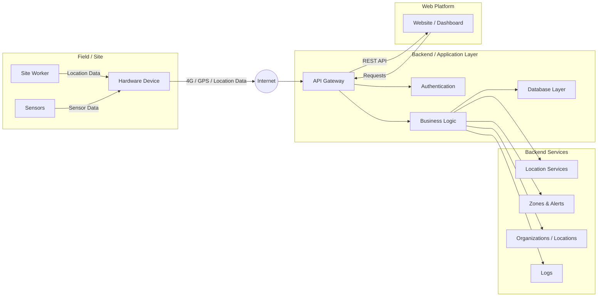
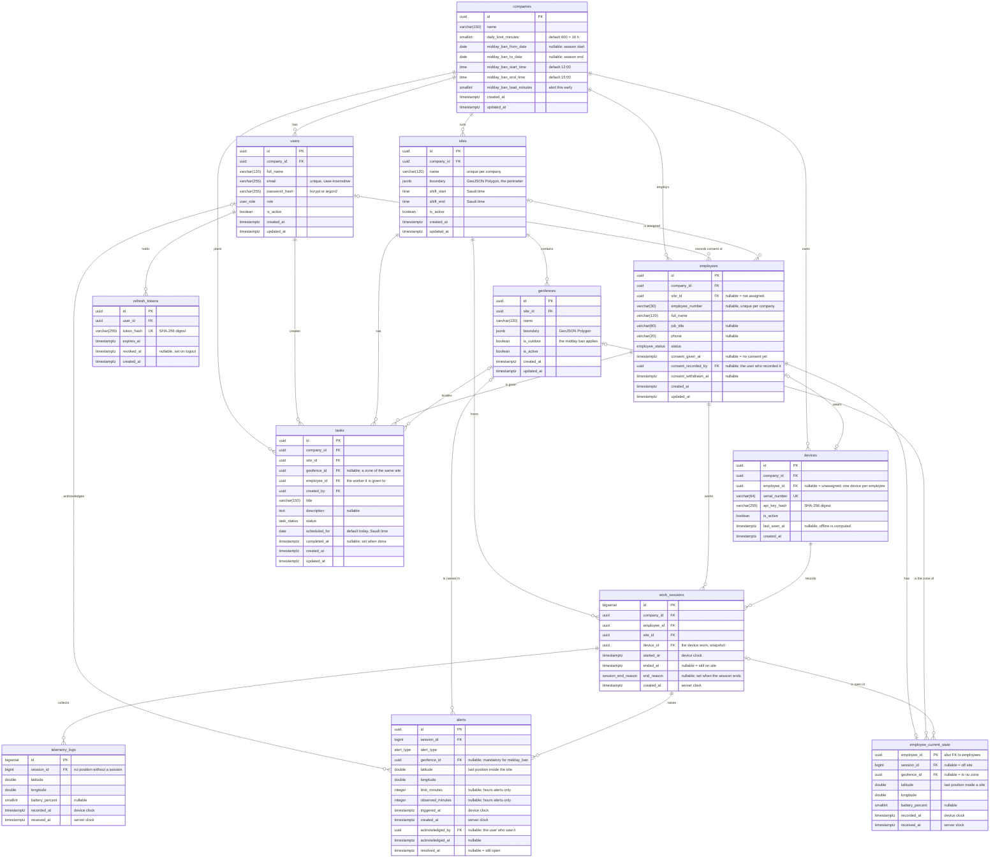
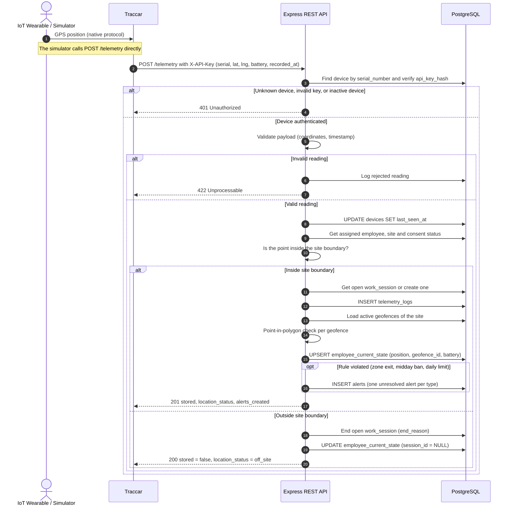
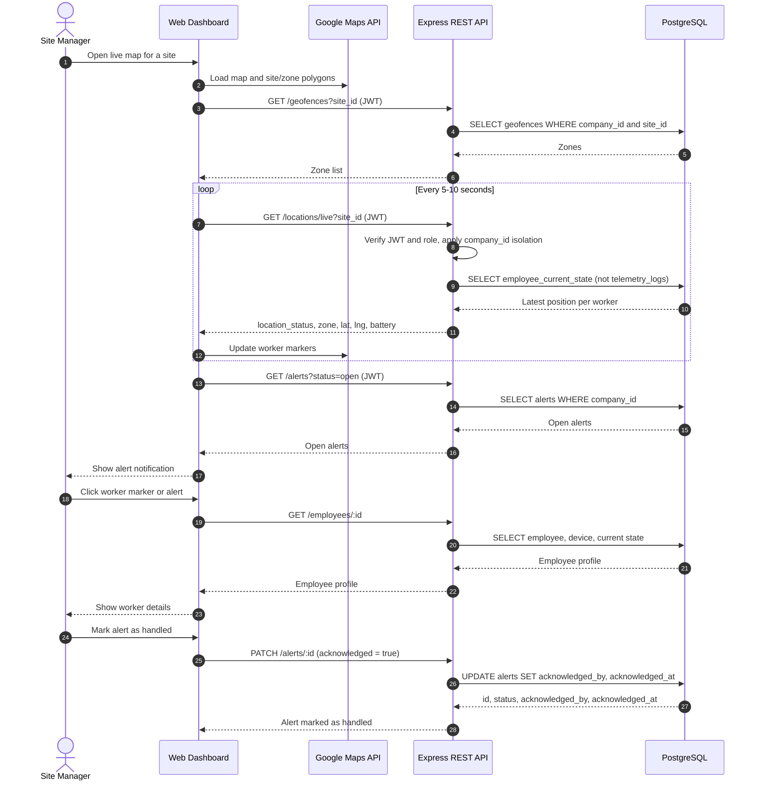
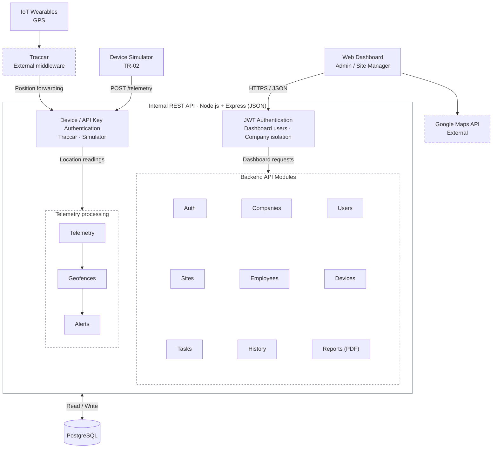

# Portfolio Project - Technical Documentation (Stage 3)

## Introduction

Stage 3 of the Portfolio Project is about turning the project's objectives and requirements into a detailed technical plan before development begins. In this stage we produce the **Technical Documentation**: the blueprint that defines what the system will do from the user's perspective, how it will be built, how its components will interact, and how we will manage and test our code.

The value of this stage is that it removes guesswork from development. It gives every team member a clear understanding of the system's architecture, data structures, and interfaces, so that frontend, backend, and IoT work can progress in parallel without conflicts. It also ensures that every technical decision is justified by our functional and non-functional requirements, reducing the risk of rework during the 6-week MVP.

This document builds on the scope defined in our [Project Charter](./Stage%202.md).

## Table of Contents
- [0. Define User Stories and Mockups](#0-define-user-stories-and-mockups)
- [1. Design System Architecture](#1-design-system-architecture)
- [2. Define Components, Classes, and Database Design](#2-define-components-classes-and-database-design)
- [3. Create High-Level Sequence Diagrams](#3-create-high-level-sequence-diagrams)
- [4. Document External and Internal APIs](#4-document-external-and-internal-apis)
- [5. Plan SCM and QA Strategies](#5-plan-scm-and-qa-strategies)
- [6. Technical Justifications](#6-technical-justifications)
- [7. Authors](#7-authors)

---

## 0. Define User Stories and Mockups

The purpose of this task is to identify and prioritize the MVP's functionalities from the user's perspective and visualize its main interface.

Our team follows the Scrum methodology to manage development. Before writing user stories, we first establish a baseline of business and technical requirements. This ensures that every user story is traceable to a clear business need and a defined technical capability, and prevents the backlog from filling with features that fall outside our scope.

Our process is as follows:

1. **Business Requirements:** Define what the organization needs from the platform, based on the objectives in our Project Charter.
2. **Technical Requirements:** Translate those needs into functional and non-functional requirements the system must meet.
3. **User Types:** Identify who interacts with the system and in what role.
4. **User Stories:** Break the requirements into user stories grouped by epic, written in the format
 "As a [user type], I want to [perform an action], so that [achieve a goal]."
5. **Prioritization:** Prioritize each story using the **MoSCoW** method: Must Have, Should Have, Could Have, and Won't Have.
6. **Mockups:** Design the main screens of the dashboard based on the prioritized stories.

The resulting user stories form our Product Backlog, which is managed in Jira. During each sprint planning session, the team selects stories from the backlog, starting with the Must Have items, and breaks them into development tasks. The requirements serve as a stable baseline for the MVP, while the backlog may be refined sprint by sprint as we learn more during development.

### 0.1 Business Requirements

| ID | Business Requirement |
|---|---|
| BR-01 | Organizations must have a complete, automatic record of field operations: attendance, movements, and alerts. |
| BR-02 | Managers must be able to see where their workers are in real time on a site map. |
| BR-03 | The system must alert managers early when a worker leaves a designated zone or shows critical vital signs. |
| BR-04 | Managers must be able to assign tasks to employees and follow their status. |
| BR-05 | Organizations must be able to review historical data to support compliance and record keeping. |
| BR-06 | Managers must receive simple operational insights to support better decisions. |
| BR-07 | Each organization's data must remain private and accessible only to its own users. |

### 0.2 Technical Requirements

**Functional Requirements**

| ID | Technical Requirement |
|---|---|
| TR-01 | The system must receive telemetry data — location, heart rate, and timestamp — from IoT devices through a middleware server such as Traccar. |
| TR-02 | The system must provide a device simulator that sends realistic telemetry data to the API. |
| TR-03 | The backend must expose a RESTful API using JSON for all frontend operations. |
| TR-04 | The system must store companies, users, employees, devices, tasks, geofences, telemetry logs, and alerts in a relational database. |
| TR-05 | The system must detect geofence entry and exit by comparing each location reading with the defined zone boundaries. |
| TR-06 | The system must generate alerts when heart rate readings exceed predefined thresholds. |
| TR-07 | The dashboard must display worker locations on Google Maps and refresh positions automatically. |
| TR-08 | The system must integrate with a third-party analytics tool for simple reports. |

**Non-Functional Requirements**

| ID | Requirement | Target |
|---|---|---|
| NFR-01 | Performance | Map positions refresh every 5–10 seconds without freezing the dashboard |
| NFR-02 | Alert speed | Alerts appear on the dashboard within 30 seconds of the triggering reading |
| NFR-03 | Security | Authentication on all private endpoints, hashed passwords, and HTTPS |
| NFR-04 | Data isolation | Users can only access data belonging to their own company |
| NFR-05 | Reliability | Incoming data is validated, and invalid readings are rejected and logged |
| NFR-06 | Usability | Core actions reachable within 3 clicks from the main dashboard |

### 0.3 User Types

| User | Description |
|---|---|
| **Visitor** | A potential client visiting the landing page |
| **Company Admin** | Registers the company and manages its account, employees, and devices |
| **Site Manager** | Uses the dashboard daily to monitor workers, manage zones, assign tasks, and respond to alerts |
| **Worker** | Wears the IoT device during shifts; does not use the dashboard in the MVP |
| **Developer** | Team member testing the system with simulated data |

### 0.4 User Stories by Epic

#### Epic 1: Company Account & Authentication

| ID | User Story | Priority |
|---|---|---|
| US-01 | As a Company Admin, I want to register my company, so that my organization can start using the platform. | Must Have |
| US-02 | As a Company Admin, I want to log in and log out securely, so that only authorized people can access our data. | Must Have |
| US-03 | As a Company Admin, I want my company's data to be visible only to my company's users, so that our operations stay private. | Must Have |
| US-04 | As a Company Admin, I want to add Site Manager accounts, so that my managers can use the dashboard. | Should Have |
| US-05 | As a Company Admin, I want to reset my password, so that I can regain access if I forget it. | Could Have |

#### Epic 2: Employee & Device Management

| ID | User Story | Priority |
|---|---|---|
| US-06 | As a Company Admin, I want to create, view, edit, and delete employee profiles, so that I can keep my workforce records up to date. | Must Have |
| US-07 | As a Company Admin, I want to register IoT devices in the system, so that they can be linked to employees. | Must Have |
| US-08 | As a Company Admin, I want to assign a device to an employee, so that incoming data is linked to the right person. | Must Have |
| US-09 | As a Site Manager, I want to view an employee's profile with their current status and device, so that I have all their information in one place. | Should Have |
| US-10 | As a Company Admin, I want to search and filter the employee list, so that I can find employees quickly. | Could Have |

#### Epic 3: IoT Data Integration

| ID | User Story | Priority |
|---|---|---|
| US-11 | As the system, I want to receive location and heart rate data from IoT devices, so that worker activity is captured automatically. | Must Have |
| US-12 | As the system, I want to validate and store every incoming reading with a timestamp, so that records are accurate and complete. | Must Have |
| US-13 | As a Developer, I want a device simulator that sends realistic data, so that we can develop and demo the system without depending on hardware. | Must Have |
| US-14 | As a Site Manager, I want to see when a device is offline, so that I know when data is missing. | Should Have |
| US-15 | As a Site Manager, I want to see a device's battery level, so that I can make sure devices are charged before shifts. | Could Have |

#### Epic 4: Live Map & Geofencing

| ID | User Story | Priority |
|---|---|---|
| US-16 | As a Site Manager, I want to see all workers on a live map of my site, so that I know where my teams are in real time. | Must Have |
| US-17 | As a Site Manager, I want to draw work zones on the map, so that I can define where workers should be. | Must Have |
| US-18 | As a Site Manager, I want to click on a worker on the map to see their details, so that I can quickly check their status. | Should Have |
| US-19 | As a Site Manager, I want workers on the map to be colored by status, so that I can spot issues at a glance. | Could Have |

#### Epic 5: Automated Alerts

| ID | User Story | Priority |
|---|---|---|
| US-20 | As a Site Manager, I want to receive an alert when a worker leaves a designated zone, so that I can respond quickly. | Must Have |
| US-21 | As a Site Manager, I want to receive an alert when a worker's heart rate exceeds a safe threshold, so that I can act before fatigue becomes an incident. | Must Have |
| US-22 | As a Site Manager, I want to view a list of all alerts, so that I can review what happened during the day. | Must Have |
| US-23 | As a Site Manager, I want to mark an alert as handled, so that my team knows it has been addressed. | Should Have |
| US-24 | As a Company Admin, I want to adjust heart rate thresholds, so that alerts fit our working conditions. | Could Have |

#### Epic 6: Task & Workload Assignment

| ID | User Story | Priority |
|---|---|---|
| US-25 | As a Site Manager, I want to create a task and assign it to an employee, so that everyone knows their responsibilities. | Must Have |
| US-26 | As a Site Manager, I want to update a task's status, so that I can track progress. | Should Have |
| US-27 | As a Site Manager, I want to see all tasks assigned to an employee, so that I can balance workloads. | Should Have |

#### Epic 7: History & Records

| ID | User Story | Priority |
|---|---|---|
| US-28 | As a Site Manager, I want to view an employee's movement history for a selected day, so that I can review what happened on site. | Must Have |
| US-29 | As a Site Manager, I want to see each employee's daily record of attendance, alerts, and tasks, so that I have reliable records for compliance. | Should Have |
| US-30 | As a Site Manager, I want to replay a worker's movements on the map, so that I can visualize their path during the day. | Could Have |

#### Epic 8: Analytics

| ID | User Story | Priority |
|---|---|---|
| US-31 | As a Site Manager, I want to see simple analytics on attendance, time spent per zone, and alert counts, so that I can make better decisions. | Should Have |
| US-32 | As a Company Admin, I want to export daily records as a file, so that I can share them with clients or auditors. | Could Have |

#### Epic 9: Landing Page

| ID | User Story | Priority |
|---|---|---|
| US-33 | As a Visitor, I want to read about the platform on a landing page, so that I understand its value. | Should Have |
| US-34 | As a Visitor, I want a clear button to register my company, so that I can start using the platform. | Should Have |

#### Won't Have in the MVP

| ID | User Story | Priority |
|---|---|---|
| US-35 | As a Site Manager, I want to search for a specific worker on the map, so that I can locate them quickly. | Won't Have |
| US-36 | As a Company Admin, I want to manage multiple sites, so that I can oversee all my projects. | Won't Have |
| US-37 | As a Worker, I want to send an SOS signal from my device, so that I can get help in an emergency. | Won't Have |
| US-38 | As a Site Manager, I want the nearest ambulance to be alerted automatically, so that emergencies are handled faster. | Won't Have |
| US-39 | As a Site Manager, I want a mobile app, so that I can monitor my site on the go. | Won't Have |

---

## 1. Design System Architecture
# System Architecture

This document describes the high-level architecture of the system, including the field devices, mobile application, internet communication, backend services, database, and web dashboard.

## High-Level Architecture


## Architecture Components

### 1. Field / Site

The field layer represents the physical environment where the site worker operates.

- **Site Worker** — Person being monitored by the system.
- **Hardware Device** — Device responsible for collecting and transmitting location data.
- **Mobile Application** — Provides communication and additional sensor data.
- **Sensors** — Collect data such as health or environmental information.

### 2. Internet

The collected data is transmitted through the Internet to the backend infrastructure.

The system may use:

- GPS
- 4G / Cellular connectivity
- Mobile sensors
- Health monitoring data

### 3. Backend / Application Layer

The backend is responsible for receiving, processing, validating, and storing the incoming data.

#### API Gateway

The API Gateway acts as the main entry point for communication between clients and the backend.

Responsibilities include:

- Receiving API requests
- Routing requests
- Validating requests
- Returning responses
- Communicating with backend services

#### Authentication

Handles user authentication and authorization.

Examples:

- User login
- Access tokens
- Role-based access
- API authentication

#### Business Logic

Contains the core application logic.

It processes:

- Worker locations
- Zones
- Alerts
- Organizations
- Site information
- Monitoring rules

#### Database Layer

Responsible for persistent storage of system data.

Possible data includes:

- Users
- Workers
- Locations
- Organizations
- Zones
- Alerts
- Sensor data
- Logs

### 4. Backend Services

The backend provides several specialized services.

#### Location Services

Responsible for processing and managing worker location data.

#### Zones & Alerts

Responsible for:

- Defining geographic zones
- Detecting zone entry/exit
- Generating alerts
- Monitoring worker movement

#### Organizations / Locations

Manages organizations, sites, and their associated geographical areas.

#### Logs

Stores system activities and historical events for monitoring and auditing.

### 5. Web Platform

The website provides a dashboard for administrators and authorized users.

The dashboard can be used to:

- Monitor workers
- View live locations
- View zones
- Receive alerts
- Review logs
- Manage organizations
- View historical data

The Web Platform communicates with the backend through the API Gateway.

## Data Flow

The general data flow is:

```text
Site Worker
     │
     ▼
Hardware / Mobile Device
     │
     ├── GPS Data
     ├── Health Data
     └── Sensor Data
     │
     ▼
   Internet
     │
     ▼
 API Gateway
     │
     ▼
Business Logic
     │
     ├── Location Services
     ├── Zones & Alerts
     ├── Organizations
     └── Logs
     │
     ▼
 Database
     │
     ▼
Web Dashboard
```

## Communication

The system is designed around API-based communication:

```text
Hardware / Mobile
       │
       ▼
    Internet
       │
       ▼
  Backend API
       │
       ▼
Business Logic
       │
       ▼
   Database
       │
       ▼
Web Dashboard
```

This architecture separates the **field devices**, **application logic**, **data storage**, and **user interface**, making the system easier to maintain, scale, and extend.
---

## 2. Define Components, Classes, and Database Design

The purpose of this task is to detail the internal structure of the system: the classes of the back-end, the design of the database and the components of the front-end.

### 2.1 Back-End Classes

*To be added by the Backend lead: the main classes, their attributes and their methods.*

### 2.2 Database Design

The system uses a relational database, **PostgreSQL**. The schema has been written as an executable migration. It contains **12 tables and 1 view**.

#### Tables

| # | Table | Purpose |
|---|---|---|
| 1 | `companies` | The tenant: one row per client organization, with the settings of its alert rules |
| 2 | `users` | Dashboard accounts: Company Admins and Site Managers |
| 3 | `refresh_tokens` | Stored session tokens, so that logging out really revokes a session |
| 4 | `sites` | The project sites of a company: perimeter and planned shift |
| 5 | `employees` | The workers being tracked, their site and their consent |
| 6 | `devices` | Wearables, real or simulated, and the employee each one is assigned to |
| 7 | `geofences` | The work zones drawn inside a site, and whether each is outdoor |
| 8 | `work_sessions` | The attendance record: each continuous presence of a worker on a site |
| 9 | `telemetry_logs` | Every position that was stored; the movement history |
| 10 | `alerts` | What the rule engine found, and how it was handled |
| 11 | `employee_current_state` | The latest position of each employee; feeds the live map |
| 12 | `tasks` | Work given to one employee, on a site, for a day |
| – | `daily_work_records` (view) | Minutes per worker, site and day, summed from the sessions |

#### Entity-Relationship Diagram



`PK` = primary key, `FK` = foreign key, `UK` = unique. A column is mandatory unless it is marked *nullable*.

#### Key Design Decisions

1. **The work session is the centre of the record.** `work_sessions` holds one row for each continuous presence of a worker on a site, so hours are a simple sum. Every position and every alert belongs to a session.
2. **The live state is separated from the history.** The live map reads `employee_current_state`, one row per employee that is updated in place, and never the growing `telemetry_logs`. Its speed therefore does not degrade over time.
3. **Tenant isolation is part of the schema.** Tables owned by a company carry `company_id`, and composite foreign keys that include it make the database refuse a link between rows of two companies.
4. **Privacy is enforced by the structure.** A position cannot be stored outside a work session, and a trigger refuses to open a session for a worker who has not consented.
5. **At most one unresolved alert of each type per session.** A partial unique index guarantees it, so a worker who stays in a banned zone produces one alert, not hundreds.
6. **Records are deactivated, not deleted.** Foreign keys use `ON DELETE RESTRICT`, so anything that has history cannot be removed.
7. **Types follow the use.** Identifiers that appear in URLs are UUIDs; the two high-volume tables use sequential `BIGSERIAL` keys; all timestamps are `TIMESTAMPTZ`.

### 2.3 Front-End Components

*To be added by the Frontend lead: the main UI components and their interactions.*

---

## 3. Create High-Level Sequence Diagrams


# System Architecture Sequence Diagrams

This document contains the sequence diagrams for the core system workflows, formatted for native rendering on GitHub using Mermaid.js.

## 1. Authentication & Token Management

This diagram outlines the registration, login, and token refresh/logout flows for a Company Admin.

```mermaid
sequenceDiagram
    autonumber
    actor Admin as Company Admin
    participant Web as Web Dashboard
    participant API as Express REST API
    participant DB as PostgreSQL

    rect rgb(30, 30, 30)
    note right of Admin: Registration
    end
    Admin->>Web: Fill in company and admin details
    Web->>API: POST /auth/register
    API->>API: Validate input and hash password
    API->>DB: INSERT companies, users (role = company_admin)
    DB-->>API: company_id, user_id
    API->>API: Issue access token (JWT) and refresh token
    API->>DB: INSERT refresh_tokens (token_hash)
    API-->>Web: 201 access_token, refresh_token, user, company
    Web-->>Admin: Redirect to dashboard

    rect rgb(30, 30, 30)
    note right of Admin: Login
    end
    Admin->>Web: Enter email and password
    Web->>API: POST /auth/login
    API->>DB: SELECT user by email
    alt Invalid credentials or inactive user
        API-->>Web: 401 Unauthorized
        Web-->>Admin: Show error message
    else Valid credentials
        API->>API: Verify password hash
        API->>DB: INSERT refresh_tokens
        API-->>Web: 200 access_token, refresh_token, expires_in, user
        Web-->>Admin: Open dashboard
    end

    rect rgb(30, 30, 30)
    note right of Admin: Token refresh and logout
    end
    Web->>API: POST /auth/refresh (refresh_token)
    API->>DB: Check token_hash, expires_at, revoked_at
    API-->>Web: New access_token
    Admin->>Web: Click logout
    Web->>API: POST /auth/logout (refresh_token)
    API->>DB: UPDATE refresh_tokens SET revoked_at = now()
    API-->>Web: 204 No Content
```



## 2. IoT Telemetry Processing

This diagram shows how device coordinates are ingested, validated, checked against geofences, and stored.



## 3. Live Map & Alert Management

This diagram details the Site Manager's view, polling for real-time locations, and handling alerts.



---

## 4. Document External and Internal APIs
This section defines how our platform communicates with the outside world. It lists the external APIs the system relies on and why each was chosen. It then specifies our own internal API: a RESTful API built with Node.js and Express that exchanges JSON. The Web Dashboard and the telemetry sources (Traccar and the device simulator) use this API to reach the backend. Field names and types follow the database design in Section 2.


---

### 4.1 External APIs

| External API | Used by | Purpose in our system | Why we chose it |
|---|---|---|---|
| **Google Maps JavaScript API** | Web Dashboard (Frontend) | Displays the live site map and worker markers (US-16, US-18, US-19), draws and shows site boundaries and work zones (US-17), and replays movement paths (US-30). | It has strong, accurate map coverage in Saudi Arabia, clear documentation, and a free usage tier that is enough for an MVP. It also supports markers and polygons, which we need for workers, sites, and zones (TR-07). |
| **Traccar** (open-source GPS tracking server) | Backend (ingestion) | Receives raw data from the GPS wearables over their native protocols, normalizes it, and forwards each position to our API as JSON. | Traccar supports hundreds of GPS protocols and device models. Our backend therefore does not depend on one vendor's data format, which reduces the *System-Device Mismatch* risk identified in Stage 2. It is open source, self-hosted, and has a built-in HTTP position-forwarding feature. |

---

### 4.2 Internal API Endpoints — Summary

All paths are relative to the base URL `/api/v1`.

**Roles:** `Public` = no token · `Admin` = company_admin · `Manager` = site_manager (Admin can do everything a Manager can) · `Device` = device API key

| # | Method | Endpoint | Purpose | Access | Input | Output |
|---|---|---|---|---|---|---|
| 1 | POST | `/auth/register` | Register a company and its admin account | Public | `{ company_name, full_name, email, password }` | `{ access_token, refresh_token, user, company }` |
| 2 | POST | `/auth/login` | Log in and receive access and refresh tokens | Public | `{ email, password }` | `{ access_token, refresh_token, expires_in, user }` |
| 3 | POST | `/auth/refresh` | Get a new access token using a refresh token | Public (refresh token) | `{ refresh_token }` | `{ access_token, expires_in }` |
| 4 | POST | `/auth/logout` | Log out by revoking the refresh token | Admin, Manager | `{ refresh_token }` | `204` (no body) |
| 5 | POST | `/users` | Create a Site Manager account | Admin | `{ full_name, email, password }` | `{ id, full_name, email, role, is_active }` |
| 6 | GET | `/users` | List the company's user accounts | Admin | — | `{ data: [user] }` |
| 7 | POST | `/sites` | Create a project site with its boundary and shift | Admin | `{ name, boundary, shift_start, shift_end }` | `{ id, name, boundary, shift_start, shift_end, is_active }` |
| 8 | GET | `/sites` | List the company's sites | Admin, Manager | `?is_active` | `{ data: [site] }` |
| 9 | PATCH | `/sites/:id` | Update a site | Admin | `{ name?, boundary?, shift_start?, shift_end? }` | Updated site |
| 10 | DELETE | `/sites/:id` | Deactivate a site | Admin | — | `204` (no body) |
| 11 | POST | `/employees` | Create an employee profile and record consent | Admin | `{ full_name, employee_number?, job_title?, phone?, site_id?, consent_given? }` | `{ id, full_name, site_id, status, consent_given_at }` |
| 12 | GET | `/employees` | List, search, and filter employees | Admin, Manager | `?search, site_id, status, has_consent, page, limit` | `{ data: [employee], page, limit, total }` |
| 13 | GET | `/employees/:id` | View an employee profile with status and device | Admin, Manager | — | `{ id, full_name, site, device, current_state }` |
| 14 | PATCH | `/employees/:id` | Edit a profile, or record or withdraw consent | Admin | Any field of #11, or `{ consent_given }` | Updated employee |
| 15 | DELETE | `/employees/:id` | Deactivate an employee (records are kept) | Admin | — | `204` (no body) |
| 16 | POST | `/devices` | Register an IoT device and issue its API key | Admin | `{ serial_number }` | `{ id, serial_number, employee_id, is_active, api_key }` |
| 17 | GET | `/devices` | List devices with online status and battery | Admin, Manager | `?site_id, online` | `{ data: [{ id, serial_number, employee, online, battery_percent, last_seen_at }] }` |
| 18 | PATCH | `/devices/:id` | Assign or unassign a device to an employee | Admin | `{ employee_id }` or `{ employee_id: null }` | Updated device |
| 19 | POST | `/telemetry` | Receive a location reading from Traccar or the simulator | Device | Header `X-API-Key` + `{ serial_number, latitude, longitude, battery_percent, recorded_at }` | `{ id, session_id, stored, location_status, alerts_created }` |
| 20 | GET | `/locations/live` | Current state of each worker for the live map | Admin, Manager | `?site_id` | `{ site_id, data: [{ employee_id, location_status, zone, latitude, longitude, battery_percent }] }` |
| 21 | POST | `/geofences` | Create a work zone | Admin, Manager | `{ site_id, name, is_outdoor, boundary }` | `{ id, site_id, name, is_outdoor, boundary, is_active }` |
| 22 | GET | `/geofences` | List work zones of a site | Admin, Manager | `?site_id, is_active` | `{ data: [geofence] }` |
| 23 | PATCH | `/geofences/:id` | Update a work zone | Admin, Manager | `{ name?, is_outdoor?, boundary? }` | Updated geofence |
| 24 | DELETE | `/geofences/:id` | Deactivate a work zone | Admin, Manager | — | `204` (no body) |
| 25 | GET | `/alerts` | List alerts with filters | Admin, Manager | `?site_id, employee_id, type, status, from, to, page, limit` | `{ data: [{ id, type, status, employee, zone, triggered_at }], total }` |
| 26 | PATCH | `/alerts/:id` | Acknowledge an alert | Admin, Manager | `{ acknowledged: true }` | `{ id, status, acknowledged_by, acknowledged_at }` |
| 27 | POST | `/tasks` | Create a task and assign it to an employee | Admin, Manager | `{ title, description?, employee_id, site_id, geofence_id?, scheduled_for? }` | `{ id, title, employee_id, site_id, status: "pending" }` |
| 28 | GET | `/tasks` | List tasks (e.g. all tasks of one employee) | Admin, Manager | `?employee_id, site_id, status, scheduled_for` | `{ data: [task] }` |
| 29 | PATCH | `/tasks/:id` | Update a task's status | Admin, Manager | `{ status }` | `{ id, status, completed_at }` |
| 30 | GET | `/employees/:id/history` | Movement history of an employee for one day | Admin, Manager | `?date` | `{ employee_id, date, sessions: [{ session_id, points }] }` |
| 31 | GET | `/employees/:id/daily-record` | Daily record: attendance, minutes worked, alerts, tasks | Admin, Manager | `?date` | `{ employee_id, date, attendance, alerts, tasks }` |
| 32 | POST | `/reports` | Generate a PDF report with a reference number | Admin, Manager | `{ type, site_id, start_date }` | `{ id, reference_number, period, sha256, download_url }` |
| 33 | GET | `/reports/:id/download` | Download a generated PDF report | Admin, Manager | — | PDF file (`application/pdf`) |
> **Note:** Companies are created only through `POST /auth/register` (US-01), so there are no `/companies` endpoints. Work sessions and alerts are generated automatically by the backend while processing telemetry, so they have no create endpoints.
---

## 5. Plan SCM and QA Strategies

#### 5.1.1 Version Control & Repository Management
* **Tool:** Git hosted on GitHub.
* **Repository Architecture:** Structured mono-repository or multi-repository configuration separating frontend (`/FrontEnd` - React) and backend (`/Backend` - Express.js).
* **Access Control:** Restricted push permissions on protected primary branches (`main` and `develop`); branch protection rules require passed CI checks and mandatory code reviews before merging.

#### 5.1.2 Branching Strategy (GitFlow Model)

| Branch Type | Base Branch | Target Branch | Purpose & Rules |
| :--- | :--- | :--- | :--- |
| `main` | - | - | Production-ready, stable code. Direct pushes disabled. Deploys directly to the production Docker cluster. |
| `develop` | `main` | `main` | Active integration branch. Deploys automatically to the Staging environment. |
| `feature/*` | `develop` | `develop` | Short-lived branch for individual feature/task development (e.g., `feature/user-auth`). |
| `bugfix/*` | `develop` | `develop` | Non-critical patches created during staging or integration testing. |
| `hotfix/*` | `main` | `main` & `develop` | Emergency production fixes. Merges to both `main` and `develop` simultaneously. |

#### 5.1.3 Commit Standards & Conventions
All commits must strictly follow the **Conventional Commits** standard (`<type>(<scope>): <short summary>`):

* **Types:**
  * `feat`: A new user feature or REST API route.
  * `fix`: A bug fix in Express controllers, React components, or DB queries.
  * `docs`: Documentation updates.
  * `style`: Formatting, semicolons, linter fixes (no logic change).
  * `refactor`: Restructuring backend middleware or React component code without changing behavior.
  * `test`: Adding or updating Jest/Supertest test suites.
  * `chore`: Updating Dockerfiles, `package.json` dependencies, or GitHub Actions pipelines.

* **Examples:**
  * `feat(api): add JWT authentication endpoint in Express`
  * `fix(ui): resolve React dynamic routing hydration error`
  * `chore(docker): optimize multi-stage Docker build for React`

#### 5.1.4 Code Review & Pull Request (PR) Workflow
1. **PR Creation:** Developers open a PR targeting `develop` from a `feature/*` branch and link the corresponding issue.
2. **Automated Status Checks:** GitHub Actions triggers automated linting (`ESLint`), static analysis, and unit test suites across the Express and React projects.
3. **Peer Review:** At least **1 mandatory code review approval** is required from a team member, assessing readability, security, database query efficiency, and React component performance.
4. **Merge Execution:** Approved PRs are integrated using **Squash and Merge** to maintain a linear, easy-to-audit commit history.

---

### 5.2 Quality Assurance (QA) Strategy & Pipeline

#### 5.2.1 Testing Strategy & Pyramid

```text
       [ End-to-End (E2E) ]     -> Critical User Flows (Playwright/Cypress)
      [ Integration Testing ]   -> API Contracts & PostgreSQL ORM (Supertest & Jest)
     [     Unit Testing     ]   -> Express Handlers & React UI Components (Jest & RTL)
    [ Static Code Analysis  ]   -> ESLint, Prettier & TypeScript Syntax Checks
```

* **Static Code Analysis:** ESLint and Prettier enforce formatting guidelines pre-commit via `husky` hooks.
* **Unit Testing:**
  * **Frontend (React):** React Testing Library (RTL) and Jest verify state changes, UI component rendering, and custom hooks.
  * **Backend (Express.js):** Jest verifies utility logic, middleware execution, and controller helper functions.
* **Integration Testing:** Supertest executes HTTP requests against live Express routes connected to an isolated test **PostgreSQL Docker container**, verifying SQL queries and JSON responses.
* **End-to-End (E2E) Testing:** Playwright or Cypress runs automated browser tests covering critical end-to-end user journeys (e.g., User Signup -> Login -> Dashboard -> Database Persistence).

#### 5.2.2 QA Tools Matrix

| Category | Tool | Application |
| :--- | :--- | :--- |
| **Linting & Formatting** | ESLint / Prettier | Enforces coding rules across Express modules. |
| **Unit & Component Testing** | Jest / React Testing Library | Tests isolated frontend React components and backend functions. |
| **API & Integration Testing** | Supertest / Postman | Validates Express API endpoints, HTTP status codes, and PostgreSQL interactions. |
| **E2E Testing** | Playwright / Cypress | Simulates browser interactions across full-stack Express workflows. |
| **Containerized Test DB** | Docker (PostgreSQL) | Spins up an isolated PostgreSQL instance during CI integration test execution. |

#### 5.2.3 Deployment Pipeline (CI/CD)

The continuous deployment pipeline uses GitHub Actions to automate container builds and service deployment:

```text
[ Developer Push ] ──> [ ESLint & Jest Tests ] ──> [ Build Docker Images ]
                                                            │
[ Deploy Staging ] <── [ Merge into develop ]  <────────────┘
        │
[ Staging QA ]     ──> [ Merge into main ]     ──> [ Deploy Production Containers ]
```

1. **Staging Environment:** Automated deployment triggered upon merging into `develop`. Runs Docker Compose to update the staging container cluster for full integration testing.
2. **Production Environment:** Triggered upon merging into `main`. Deploys multi-stage, production-optimized Docker containers for the React frontend, Express backend, and PostgreSQL database with automated health checks.

#### 5.2.4 Defect Categorization & Management

| Priority | Level | Response Window | Action Plan |
| :--- | :--- | :--- | :--- |
| `P0` | Critical | < 4 hours | Production down or database corruption. Immediate `hotfix/*` created from `main`. |
| `P1` | High | < 24 hours | Major functional defect in core flow. Must be resolved before next staging release. |
| `P2` | Medium | Next Sprint | Non-blocking functional or performance bug. Logged into GitHub Issues backlog. |
| `P3` | Low | Backlog | Visual polish, cosmetic adjustments, or minor React styling issues. |

---


## 6. Technical Justifications

### 6.1 Frontend Architecture: React.js

* **Rationale:** React.js is a component-driven JavaScript library selected for building an interactive, modular Single-Page Application (SPA) user interface.
* **Benefits:**
  * **Component-Driven Development:** Encourages code reusability, modular architecture, and predictable unidirectional data flows.
  * **Virtual DOM Performance:** Minimizes direct DOM manipulations by calculating diffs in memory, ensuring fast client-side rendering and responsive UI interactions.
  * **Ecosystem & Community:** Rich ecosystem of mature libraries for client-side routing (React Router), global state management (Zustand/Redux), and UI components.
* **Trade-offs & Mitigations:** Client-Side Rendering (CSR) can lead to larger initial JavaScript bundle sizes and delayed initial page render. Mitigated by implementing code-splitting (`React.lazy` / dynamic imports), route-based lazy loading, and asset compression.

### 6.2 Backend Architecture: Express.js (Node.js)

* **Rationale:** Express.js is a lightweight, unopinionated web framework for Node.js designed to build scalable, decoupled RESTful APIs.
* **Benefits:**
  * **Non-Blocking I/O:** Leverages Node.js's asynchronous event loop to process high volumes of concurrent HTTP requests efficiently with low memory consumption.
  * **Flexibility & Ecosystem:** Integrates seamlessly with middleware for CORS policy handling, JWT authentication, request body parsing, and database ORMs/query builders.
  * **Language Uniformity:** Utilizing JavaScript/TypeScript across both frontend (React) and backend (Express) simplifies development velocity, context switching, and code sharing.
* **Trade-offs & Mitigations:** CPU-intensive computations can block the single-threaded event loop. Mitigated by offloading heavy background tasks to asynchronous job queues or worker threads.

### 6.3 Database Engine: PostgreSQL

* **Rationale:** PostgreSQL is an enterprise-grade, open-source Relational Database Management System (RDBMS) selected to manage structured data relationships with strict transactional guarantees.
* **Benefits:**
  * **ACID Compliance:** Guarantees full transactional safety, preventing partial updates or data corruption during complex multi-table operations.
  * **Relational Integrity:** Strictly enforces schemas, primary/foreign key constraints, and indexing mechanisms.
  * **Extensibility (JSONB Support):** Supports JSONB data types, allowing high-performance indexing and querying of semi-structured data alongside relational tables when necessary.
* **Trade-offs & Mitigations:** Schema modifications require structured migration steps. Mitigated by using database migration tools integrated into the Express backend deployment workflow.

### 6.4 Infrastructure & Containerization: Docker & Docker Compose

* **Rationale:** Docker encapsulates the React client, Express API, and PostgreSQL database into lightweight, isolated container environments.
* **Benefits:**
  * **Environment Consistency:** Eliminates "works on my machine" issues by standardizing Node.js runtimes, environment variables, and PostgreSQL versions across local development, staging, and production.
  * **Simplified Orchestration:** Docker Compose enables single-command execution (`docker compose up`) for the entire multi-container application stack.
  * **Efficient Deployments:** Multi-stage Docker builds separate build toolchains from runtime environments, producing minimal image sizes for faster deployments.
* **Trade-offs & Mitigations:** Slightly higher initial setup and container management overhead. Mitigated by using standardized Dockerfiles and caching base build layers in CI/CD pipelines.

---

## 7. Authors

* **Laila Alghamdi** — [GitHub](https://github.com/laila-khalid)
* **Abdullah Alzara** — [GitHub](https://github.com/JSAbdullaH)
* **Faisal Alshahrani** — [GitHub](https://github.com/call-me-prof)
* **Saad Alatar** — [GitHub](https://github.com/SaadTAr)
